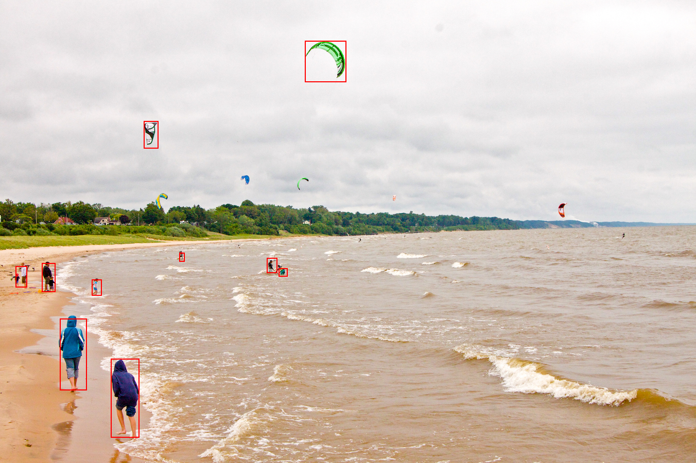

# YoloV3 Object Detection with DVPP

Please open the `jupyter-notebook` for a quick demo | [Pretrained Model](https://obs-model-ascend.obs.cn-east-2.myhuaweicloud.com/yolov3/yolov3.caffemodel)|[Original Github Repository](https://github.com/ChenYingpeng/caffe-yolov3)

## Overview

`YOLOv3/v4` A real-time object detection framework of Yolov3/v4 based on Caffe. Before `YOLOv5`, `YOLOv3` was very popular and widely used repository. This version is DVPP version of `YOLOv3`. That means, preprocessing part is handling by Huawei Ascend.



## Getting Started

Download appropriate **Yolov3 Caffe model** from the following link and put it in the _model_ folder. 

| **Model** | **CANN Version** | **How to Obtain** |
|---|---|---|
| YOLOv3 | 5.1.RC2 | [Pretrained Model](https://obs-model-ascend.obs.cn-east-2.myhuaweicloud.com/yolov3/yolov3.caffemodel) |

<details> <summary> Work on docker environment (<i>click to expand</i>)</summary>

Start your docker environment.

```bash
sudo docker run -it -u root --rm --name yolov3 -p 6565:4545 \
--device=/dev/davinci0 \
--device=/dev/davinci_manager \
--device=/dev/devmm_svm \
--device=/dev/hisi_hdc \
-v /usr/local/dcmi:/usr/local/dcmi \
-v /PATH/pyacl_samples:/workspace/pyacl_samples \
-v /usr/local/bin/npu-smi:/usr/local/bin/npu-smi \
-v /usr/local/Ascend/driver:/usr/local/Ascend/driver \
ascendhub.huawei.com/public-ascendhub/infer-modelzoo:22.0.RC2 /bin/bash
```
```bash
pip3 install --upgrade pip
pip3 install attrs numpy decorator sympy cffi pyyaml pathlib2 psutil protobuf scipy requests absl-py jupyter jupyterlab sympy
```
    
```bash
apt-get update && apt-get install -y --no-install-recommends \
        gcc \
        g++ \
        make \
        cmake \
        zlib1g \
        zlib1g-dev \
        openssl \
        libsqlite3-dev \
        libssl-dev \
        libffi-dev \
        unzip \
        pciutils \
        net-tools \
        libblas-dev \
        gfortran \
        libblas3 \
        libopenblas-dev \
        libbz2-dev \
        build-essential \
        git \
        && \
    apt-get clean && \
    rm -rf /var/lib/apt/lists/*
```
</details>

## Convert Your Model

## Converting .CAFFEMODEL format -> .OM format:
```bash
# Ascend 310
atc --model=./yolov3.prototxt \
    --weight=./yolov3.caffemodel \
    --framework=0 \
    --output=./yolov3_caffe \
    --soc_version=Ascend310 \
    --insert_op_conf=./aipp_yolov3.cfg
# Ascend 910
atc --model=./yolov3.prototxt \
    --weight=./yolov3.caffemodel \
    --framework=0 \
    --output=./yolov3_caffe \
    --soc_version=Ascend910 \
    --insert_op_conf=./aipp_yolov3.cfg
```

Install dependencies;

- numpy
- opencv_python
- Pillow

```
pip3 install -r requirements.txt
```

Finaly, open `jupyter-notebook` and run the code for demo

```bash
jupyter-notebook --port 4545 --ip 0.0.0.0 --no-browser --allow-root
```

Jupyter-notebook will open in (localhost):6565