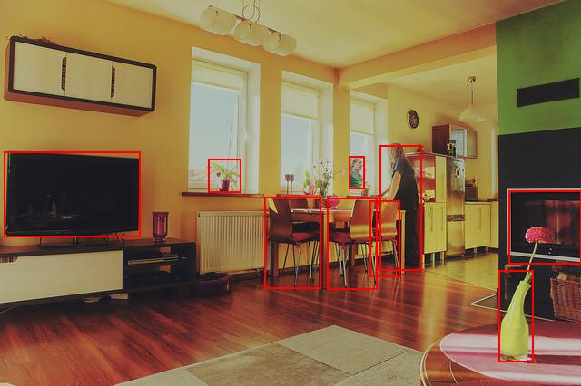

# Mindspore YOLOv5 Example

Please open the `jupyter-notebook` for a quick demo | [Pretrained Model](https://onebox.huawei.com/p/dad426ea028637e90fdef4f7a272e8cf) |[Original Repository](https://gitee.com/ktuna/mind-spore-yolov5/tree/master)

### Sample Preparation

### AIR model -> Ascend OM format

1. Download the .air model from below.

    [Pretrained .air Model](https://onebox.huawei.com/p/dad426ea028637e90fdef4f7a272e8cf)

2. Model conversion from .air to .om with ATC:
    ```bash
    # Model conversion ascend310
    atc --output=./yolov5s_ms --soc_version=Ascend310 --framework=1 --model=./deneme_320_s_yolov5s.air
    # Model conversion ascend910
    atc --output=./yolov5s_ms --soc_version=Ascend910 --framework=1 --model=./deneme_320_s_yolov5s.air
    ```

### Sample Running

Finaly, open jupyter-notebook and run the code for demo

### Jupyter Notebook Example Output

