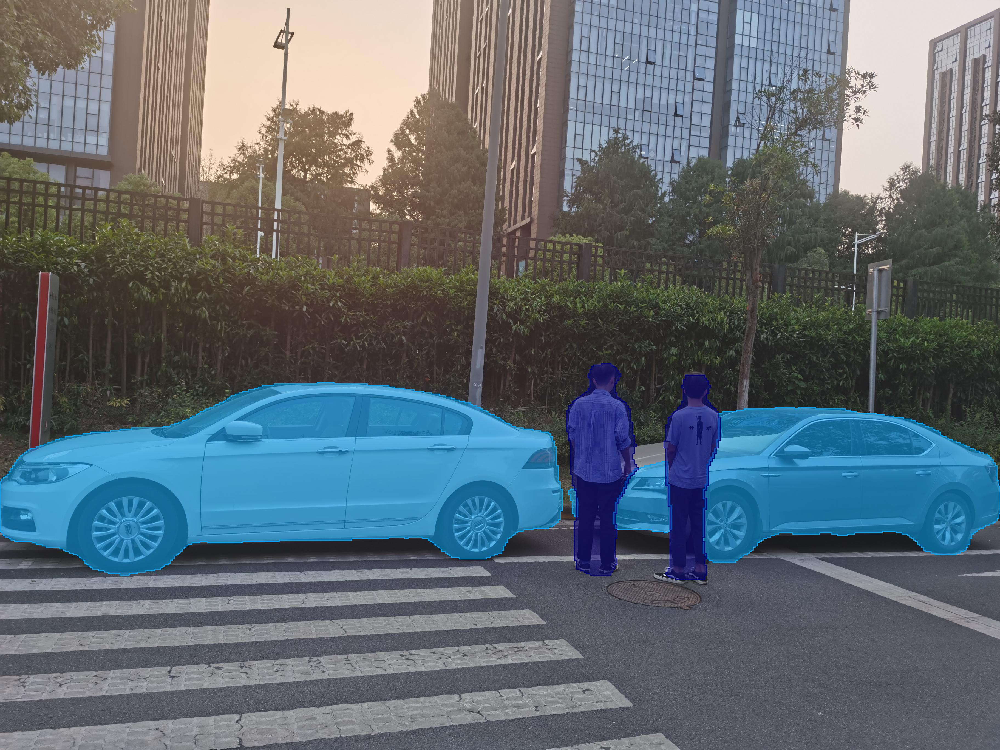

# MindSpore Deeplabv3

Please open the `jupyter-notebook` for a quick demo | [Pretrained Model](https://obs-9be7.obs.cn-east-2.myhuaweicloud.com/003_Atc_Models/AE/ATC%20Model/deeplabv3/deeplabv3_origin.air) |[Original Github Repository](https://github.com/open-mmlab/mmsegmentation)

### Sample Preparation

### AIR model -> Ascend OM format

1. Download the .air model and convert .om model.
   
    ```bash
    wget https://obs-9be7.obs.cn-east-2.myhuaweicloud.com/003_Atc_Models/AE/ATC%20Model/deeplabv3/deeplabv3_origin.air
    
    # Model conversion ascend310
    atc --output=./deeplab_513 --soc_version=Ascend310 --framework=1 --model=./deeplabv3_origin.air
    # Model conversion ascend910
    atc --output=./deeplab_513 --soc_version=Ascend910 --framework=1 --model=./deeplabv3_origin.air
    ```

2. Download the test image.
    ```bash
    wget https://obs-9be7.obs.cn-east-2.myhuaweicloud.com/003_Atc_Models/AE/ATC%20Model/deeplabv3/test_image/test.jpg
    cd ../src
    ```

### Sample Running

Finaly, open jupyter-notebook and run the code for demo

### Jupyter Notebook Example Output

