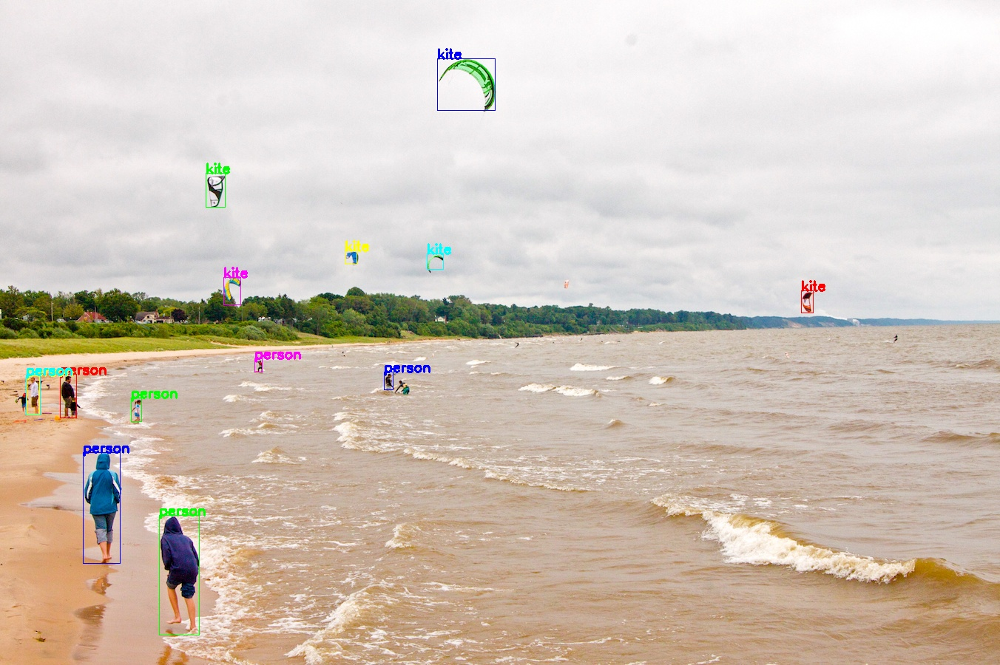

# Mindspore YOLOV4 Example

Please open the `jupyter-notebook` for a quick demo | [Pretrained Model](https://www.mindspore.cn/resources/hub/details/en?MindSpore/1.8/yolov4_coco2017) |[Original Github Repository](https://github.com/AlexeyAB/darknet)| [Paper](https://arxiv.org/abs/2004.10934)

### Sample Preparation

### CKPT model -> AIR model -> Ascend OM format

1. Download the .ckpt model.
    ```bash
    cd ./export
    ```

    [Pretrained .ckpt Model](https://www.mindspore.cn/resources/hub/details/en?MindSpore/1.8/yolov4_coco2017)

2. Convert your model. (CKPT -> AIR)
    ```bash
    bash convertmodel.sh
    ```
    or
    ```bash
    python3 export.py --ckpt_file yolov4_ascend_v180_coco2017_official_cv_acc44.ckpt --file_name yolov4_latest --file_format AIR --keep_detect True
    ```

3. After converting AIR model you should convert your model (AIR -> OM)
    ```bash
    # Model conversion ascend310
    atc --output=../model/yolov4_bs1 --soc_version=Ascend310 --framework=1 --model=./yolov4_latest.air
    # Model conversion ascend910
    atc --output=../model/yolov4_bs1 --soc_version=Ascend910 --framework=1 --model=./yolov4_latest.air
    ```

### Sample Running

Finaly, open jupyter-notebook and run the code for demo

### Jupyter Notebook Example Output

