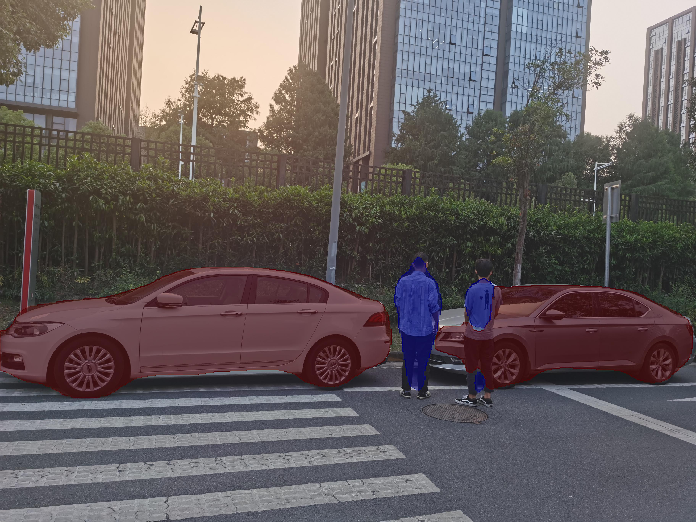

# PyTorch Deeplabv3 Plus

Please open the `jupyter-notebook` for a quick demo |[Original Github Repository](https://github.com/open-mmlab/mmsegmentation)



## Overview

DeepLabv3+ is a state-of-art deep learning model for semantic image segmentation, where the goal is to assign semantic labels (such as a person, a dog, a cat and so on) to every pixel in the input image.

## Getting started

Download following **DepLabV3+ ONNX model** from the link and put it in the _model_ folder. 

| **Model** | **Description** | **How to Obtain** |
|---|---|---|
| ATC DeepLabV3+ (FP16)| An inference model for semantic segmentation  | Download pretrained model [ModelZoo-Ascend Community](https://www.hiascend.com/zh/software/modelzoo/models/detail/1/76f4e072a489484f98073591b912ad16/1) |

**Semantic Segmentation Sample**

Function: uses the DeepLabv3 model to perform semantic segmentation on the input image and print the result on the output image.  
Input: JPG images.   
Output: JPG images with inference results

## Convert Your Model

### ONNX format -> Ascend om format

```bash
atc --model=deeplabv3_plus_res101-sim.onnx \
    --framework=5 --output_type=FP16 \
    --output=deeplabv3plus513_310 \
    --input_shape="actual_input_1:1,3,513,513" \
    --soc_version=Ascend310
```   

Install dependencies;
- opencv-python-headless
- functools
- numpy
- Pillow

```
pip install -r requirements.txt
```

Finaly, open `jupyter-notebook` and run the code for demo

```bash
jupyter-notebook --port 4545 --ip 0.0.0.0 --no-browser --allow-root
```

Jupyter-notebook will open in (localhost):6565