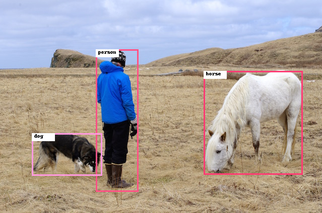

# PyTorch YOLOv4 Object Detection

Please open the `jupyter-notebook` for a quick demo | [Original Github Repository](https://github.com/Tianxiaomo/pytorch-YOLOv4)

## Overview

`YOLOv4` is a one-stage object detection model that improves on YOLOv3 with several bags of tricks and modules introduced in the literature.



## Getting started

Download following **Yolov4 PTH model** from the link and put it in the _model_ folder. 

| **Model** | **CANN Version** | **How to Obtain** |
|---|---|---|
| Yolov4 | 5.1.RC2  | Download pretrained model [Yolov4](https://drive.google.com/uc?id=1wv_LiFeCRYwtpkqREPeI13-gPELBDwuJ&export=download)

<details> <summary> Working on docker environment (<i>click to expand</i>)</summary>

Start your docker environment.

```bash
sudo docker run -it -u root --rm --name yolov4 -p 6565:4545 \
--device=/dev/davinci0 \
--device=/dev/davinci_manager \
--device=/dev/devmm_svm \
--device=/dev/hisi_hdc \
-v /usr/local/dcmi:/usr/local/dcmi \
-v /PATH/pyacl_samples:/workspace/pyacl_samples \
-v /usr/local/bin/npu-smi:/usr/local/bin/npu-smi \
-v /usr/local/Ascend/driver:/usr/local/Ascend/driver \
ascendhub.huawei.com/public-ascendhub/infer-modelzoo:22.0.RC2 /bin/bash
```

```bash
pip3 install --upgrade pip
pip3 install attrs numpy decorator sympy cffi pyyaml pathlib2 psutil protobuf scipy requests absl-py jupyter jupyterlab sympy
```

```bash
apt-get update && apt-get install -y --no-install-recommends \
        gcc \
        g++ \
        make \
        cmake \
        zlib1g \
        zlib1g-dev \
        openssl \
        libsqlite3-dev \
        libssl-dev \
        libffi-dev \
        unzip \
        pciutils \
        net-tools \
        libblas-dev \
        gfortran \
        libblas3 \
        libopenblas-dev \
        libbz2-dev \
        build-essential \
        git \
        && \
    apt-get clean && \
    rm -rf /var/lib/apt/lists/*
```
</details>

## Convert Your Model

## PTH model -> ONNX format -> Ascend OM format

For this stages it is recommended to use the docker environment to avoid affecting the development environment. The `model_convert.sh` file will do model conversion stage automatically. After conversion you should have the **.onnx** model in your `model` path.

```bash
cd <root_path_of_pyacl_samples>/pyacl_samples/PyTorch/YOLOv4/model

bash model_convert.sh
```

```bash
atc --model=yolov4.onnx \
    --framework=5 \
    --output=yolov4 \
    --input_shape="images:1,3,608,608" \
    --soc_version=Ascend310
```

Install dependencies;
- opencv-python-headless
- numpy
- Pillow

```
pip3 install -r requirements.txt
```

Finaly, open `jupyter-notebook` and run the code for demo

```bash
jupyter-notebook --port 4545 --ip 0.0.0.0 --no-browser --allow-root
```

Jupyter-notebook will open in (localhost):6565

####

We recomend to use python virtual environment for **PTH->ONNX** conversion.

- Example for python virtual environment: 
```bash
python -m venv ENV_NAME

source ENV_NAME/bin/activate
```

- Change directiory to export folder.
- Install necessary python packages using requirements.txt file:
  
```bash
pip install -r requirements.txt
```
Use the `onnx_converter.py` script to convert `PTH` file to `ONNX ` file.

```bash
python onnx_converter.py yolov4.pth ../data/dog.jpg 80 608 608
```

####