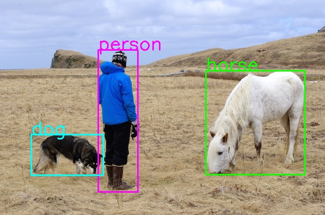

# PyTorch YOLOv4 Object Detection
Please open the `jupyter-notebook` for a quick demo | [Pretrained Model](https://drive.google.com/uc?id=1wv_LiFeCRYwtpkqREPeI13-gPELBDwuJ&export=download) | [Original Github Repository](https://github.com/Tianxiaomo/pytorch-YOLOv4)

## PTH model Downloading from Google Drive 

Google Drive files can be downloaded with the following snippet:

```py
url = "https://drive.google.com/uc?id=1wv_LiFeCRYwtpkqREPeI13-gPELBDwuJ&export=download"
output = "yolov4.pth"
gdown.download(url, output)
```

## PTH model -> ONNX format -> Ascend OM format

Use this step to convert  **`yolov4.pth`**  to  **`yolov4.onnx`**. 

We recomend to use python virtual environment for **PTH->ONNX** conversion.

- Example for python virtual environment: 
```bash
python -m venv ENV_NAME

source ENV_NAME/bin/activate
```

- Change directiory to export folder.
- Install necessary python packages using requirements.txt file:
  
```bash
pip install -r requirements.txt
```
Use the `onnx_converter.py` script to convert `PTH` file to `ONNX ` file.

```bash
python onnx_converter.py yolov4.pth ../data/dog.jpg 80 608 608
```
### ONNX -> OM

```bash
atc --model=yolov4.onnx \
    --framework=5 \
    --output=yolov4 \
    --input_shape="images:1,3,608,608" \
    --soc_version=Ascend310
```


### Jupyter Notebook Example Output



</br></br></br></br></br></br></br></br></br>


<p align="center">

</p>
