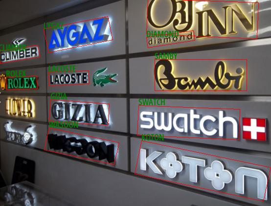

# PyTorch Deep Text Recognition
Please open the `jupyter-notebook` for a quick demo | [Pretrained Model](https://onebox.huawei.com/p/c15d10921f844d83c23533394e7480e9) | [Paper](https://arxiv.org/pdf/1904.01906.pdf) | [Original Github Repository](https://github.com/clovaai/deep-text-recognition-benchmark)

## Overview
`PyTorch` implementation for two-stage Scene Text Recognition (STR), that most existing STR models fit into.

Using this framework, texts detected by [PyTorch-CRAFT](https://gitee.com/tianyu__zhou/pyacl_samples/tree/a800/acl_craft_pt) can identification.



## Getting started
Install dependencies;
- opencv-python >= 3.4.2
- functools

```
pip install -r requirements.txt
```
And then download the `PT` file of from the link.

### PT model -> ONNX format -> Ascend om format
#### PT -> ONNX
Use in the original repository  the `model/onnx_export.py` the script to convert `PT` file to `ONNX ` file.

#### ONNX -> OM
And then use in the same directory atc tool to convert `ONNX ` file to `OM` file as as follows.
```bash
atc --model=None-ResNet-None-CTC.onnx \
    --framework=5 \
    --output=None-ResNet-None-CTC \
    --soc_version=Ascend310
```

Finaly, open `jupyter-notebook` and run the code for demo

**Note :** Do not forget to give the boxes_path including the polygon coordinates detected by PyTorch-CRAFT for demo.

## Citation
```
@inproceedings{baek2019STRcomparisons,
  title={What Is Wrong With Scene Text Recognition Model Comparisons? Dataset and Model Analysis},
  author={Baek, Jeonghun and Kim, Geewook and Lee, Junyeop and Park, Sungrae and Han, Dongyoon and Yun, Sangdoo and Oh, Seong Joon and Lee, Hwalsuk},
  booktitle = {International Conference on Computer Vision (ICCV)},
  year={2019},
  pubstate={published},
  tppubtype={inproceedings}
}
```

## Resources
[1] https://github.com/axinc-ai/ailia-models/issues/302

[2] https://colab.research.google.com/github/tulasiram58827/ocr_tflite/blob/main/colabs/Deep_Text_Recognition_TFLite.ipynb#scrollTo=OzhcDAc5kvJK

[3] https://github.com/clovaai/deep-text-recognition-benchmark/issues/76