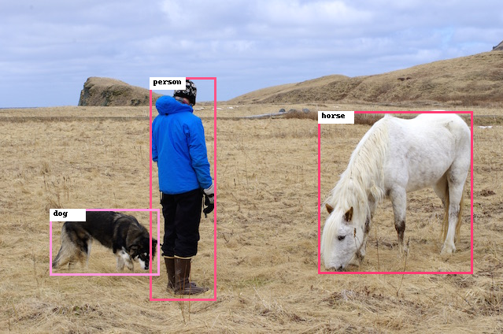

# PyTorch YoloV5 Object Detection
Please open the `jupyter-notebook` for a quick demo | [Pretrained Model](https://github.com/ultralytics/yolov5/releases/tag/v6.1) | [Original Github Repository (v6.1)](https://github.com/ultralytics/yolov5/tree/v6.1)

## PT model -> ONNX format -> Ascend om format
### PT -> ONNX
Use this step to convert  **`yolov5s.pt`**  to  **`yolov5s.onnx`**. 

We recomend to use python virtual environment for **PT->ONNX** conversion.

- Example for python virtual environment: 
```bash
python -m venv ENV_NAME

source ENV_NAME/bin/activate
```

- Example for conda virtual environment:

```bash
conda create -n ENV_NAME

conda activate ENV_NAME
```
- Change directiory to export folder.
- Install necessary python packages using requirements.txt file:
  
```bash
pip install -r requirements.txt
```
Use the `onnx_converter.py` script to convert `PT` file to `ONNX ` file.

```bash
python onnx_converter.py --weights yolov5s.pt
```

If you got conversion error while converting to ONNX, you should check your `torch` and `torchvision` versions.(`torch==1.10.2` and `torchvision==0.11.3`)

### ONNX -> OM

```bash
cd ./model
atc --model=yolov5s.onnx \
    --framework=5 \
    --output=yolov5s_v6 \
    --input_format=NCHW \
    --soc_version=Ascend310 \ # Change soc_version variable (Ascend310/Ascend910) for different chip architectures
    --input_shape="images:1,3,640,640" \
    --enable_small_channel=1 \
    --output_type=FP16 \
    --insert_op_conf=aipp.cfg
```

### Jupyter Notebook Example Output



</br></br></br></br></br></br></br></br></br>


<p align="center">

</p>
